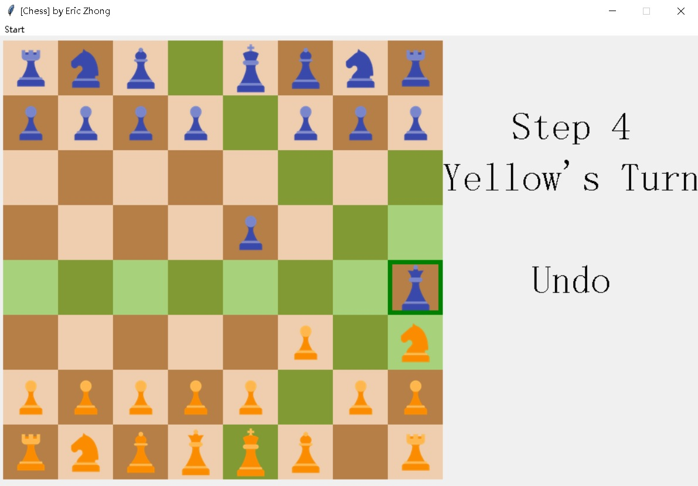

# Chess (Python/Tkinter)

A two-player chess game implemented in Python with a graphical interface powered by Tkinter.

## Screenshots



## Features

- **Classic Chess:** Full chess experience for two players on a standard 8x8 board.
- **Intuitive GUI:** Play with simple mouse clicks—no need for console commands.
- **Undo Support:** Revert to previous moves with an in-game button.
- **Turn Indicator:** The UI shows whose turn it is (Blue or Yellow).
- **Endgame Detection:** The game announces the winner when a king is captured.
- **Menus:** Restart the game from the menu at any time.
- **Custom Piece Graphics:** Each chess piece is represented with an image.

> **Note:** Some advanced rules (castling, en passant, check/checkmate enforcement) are marked as TODO and may not be fully implemented.

## How to Play

1. **Run the Game:**  
   Make sure you have Python 3 and Pillow installed. Then run:

   ```bash
   python play.py
   ```

2. **Controls:**
   - **Left Mouse Button:** Select and move pieces.
   - **Undo:** Click the "Undo" area on the right to revert the last move.
   - **Restart:** Use the menu to restart the game.

3. **Objective:**  
   Capture the opponent’s king to win the game.

## Project Structure

```bash
PythonGamesProj/Chess/
├── play.py           # Main game logic and UI
├── Soldiers.py       # Chess piece logic
├── pic/              # Images for chess pieces
└── README.md         # This file
```

## Requirements

- Python 3.x
- [Pillow](https://python-pillow.org/) (`pip install pillow`)

## Credits

- Developed by [EricZhongYJ](https://github.com/EricZhongYJ)
- Piece logic and GUI built from scratch using Tkinter.

---

**Enjoy your game of Chess!**
