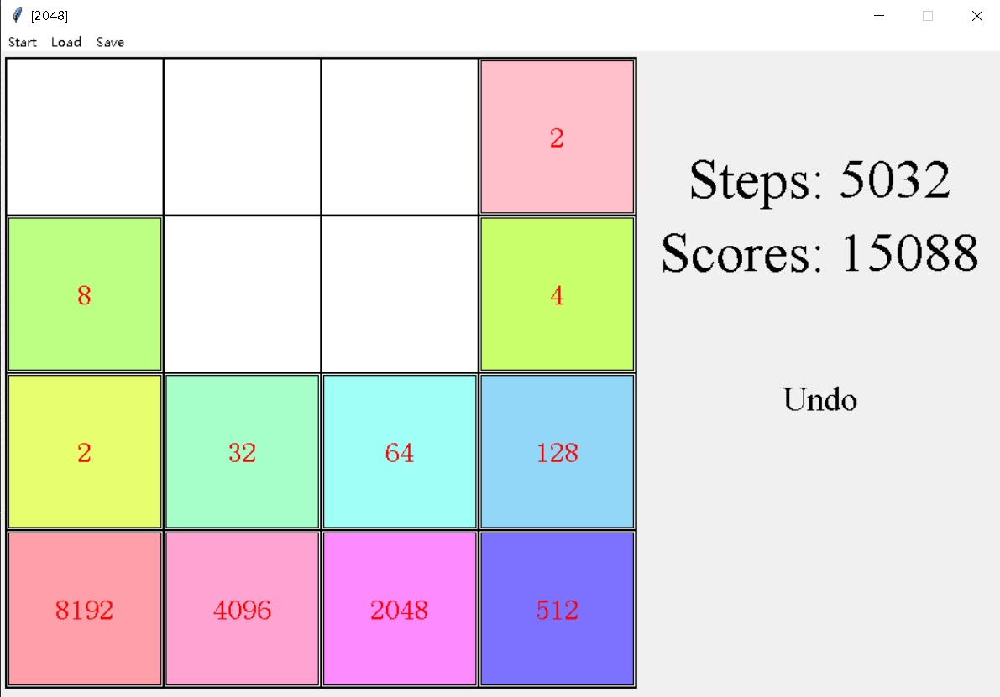

## 🧩 2048 Game in Python (Tkinter GUI)
A Python implementation of the classic 2048 puzzle game, built with Tkinter for graphical interface. This version includes essential features like saving/loading game state and undoing moves.

### 📷 Screenshot


### 🎮 Features
* ✅ Graphical UI built with tkinter

* ✅ Full 2048 game logic with merging and score tracking

* ✅ Undo functionality (any steps revert)

* ✅ Persistent save/load support using txt file

* ✅ Autosave/autoload when closing/opening the game

* ✅ Game ends only when no moves are possible (no fixed win condition)

* ✅ Modular code structure for easy extension

### 📦 Requirements
Python 3.7+

Standard Library only (no external packages needed)

### 🚀 How to Run
```bash
python Game2048.py
```
You’ll see a GUI window pop up. Use arrow keys to move the tiles.

### 💾 Save & Load
The game automatically saves the current state to a local file (autosave.txt) after each move. When you reopen the game, it will load the last saved state. You can also save and load manually.

### ↩️ Undo
You can press the "Undo" button (or a keyboard shortcut Ctrl + Z) to revert to the previous move. The game only stores one level of undo history.

### 🧠 Rules
* Combine tiles with the same number by sliding them in one of four directions.

* Each move spawns a new tile (2 or 4).

* The game ends when there are no more possible moves.

* There is no fixed win condition (e.g., reaching 2048); players may continue as long as possible.

### 📁 Project Structure
```bash
PythonGamesProj/Game2048/
├── Game2048.py         # Main game logic and UI
├── autosave.txt        # Auto-saved game state
└── README.md           # This file
```

### 📄 License
MIT License. Feel free to fork or extend the game.

