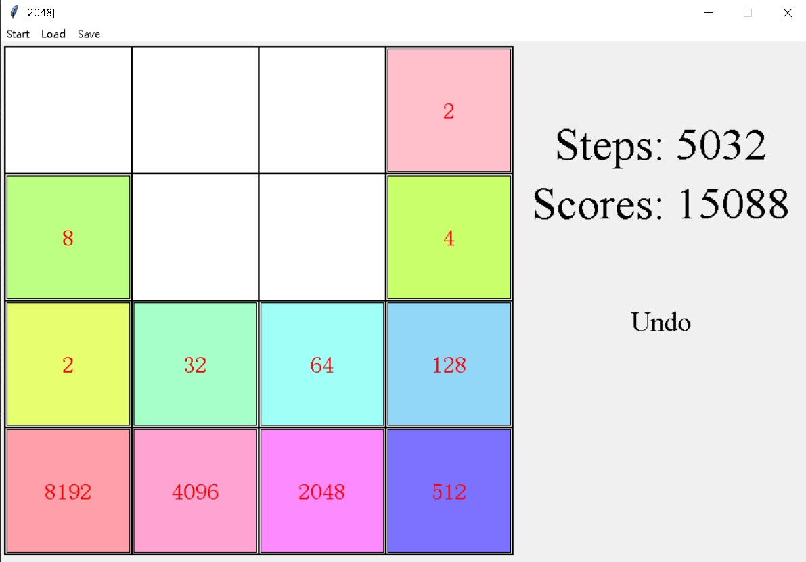
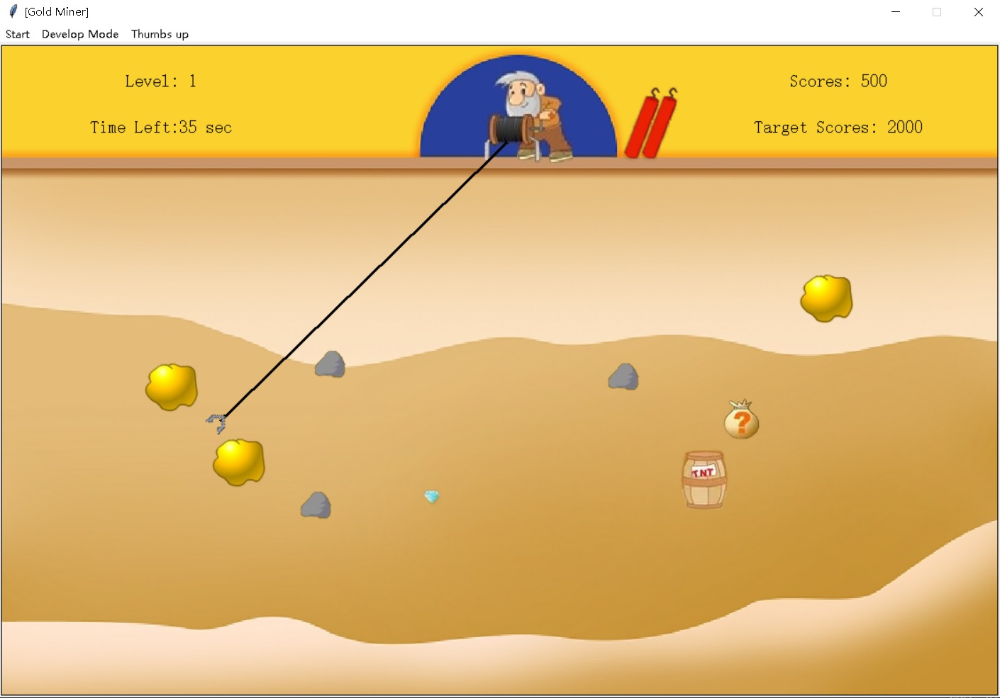
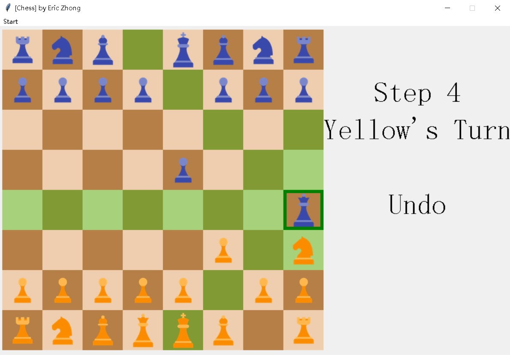

# Some small games in Python with tkinter GUI surface

## 1. [2048 Game](./Game2048) in Python (Tkinter GUI)
A Python implementation of the classic 2048 puzzle game, built with Tkinter for graphical interface. This version includes essential features like saving/loading game state and undoing moves.

### 📷 Screenshot

## 2. [Gold Miner](./GoldMiner) in Python (Tkinter GUI)

A classic Gold Miner game implemented in Python with a graphical interface powered by Tkinter.

### 📷 Screenshot

## 3. [Chess](./Chess) in Python (Tkinter GUI)

A two-player chess game implemented in Python with a graphical interface powered by Tkinter.

### 📷 Screenshot

